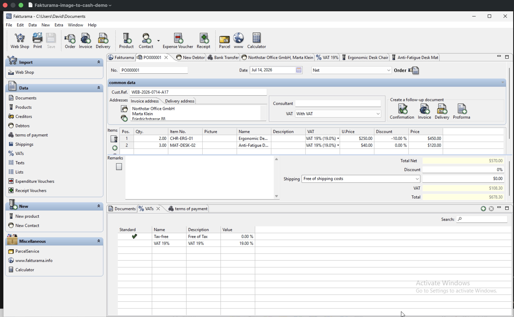

# Fakturama Image-to-Cash Automation



Turns a single order image into a saved, verified Order and linked Invoice inside
[Fakturama](https://www.fakturama.info/), resolving or creating the Debtor and Product
master records along the way, without hardcoded coordinates or a fixed UI layout.

See [`docs/design.md`](docs/design.md) for the original design document.

## Requirements

- **Windows**, with [Fakturama](https://www.fakturama.info/download/) installed at its
  default location (`C:\Program Files\Fakturama2\Fakturama.exe` - see
  `FAKTURAMA_PATH` in `src/fakturama_image_to_cash/uia/order_invoice.py` if yours differs).
- Python 3.14+ and [uv](https://docs.astral.sh/uv/).
- An Anthropic API key with access to `claude-opus-5` (vision-capable).

## Setup

```powershell
uv sync
```

Create a `.env` file in the project root (gitignored):

```
ANTHROPIC_API_KEY=sk-ant-...
ANTHROPIC_WORKSPACE_ID=wrkspc_...
```

`ANTHROPIC_WORKSPACE_ID` is only needed for an **identity-linked** key (tied to a
personal login rather than a workspace - the API will reject requests with
`anthropic-workspace-id is required...` if so); a plain workspace-scoped key can omit
it. Load it with `uv run --env-file .env ...` (see below), or set
`$env:ANTHROPIC_API_KEY` directly for the session instead.

**Start Fakturama and leave it running** before running the automation - it attaches to
the already-running application; it does not launch or manage the process itself.

## Running

Run the test suite (extraction/parsing logic only, mocked LLM responses - no API key or
Fakturama needed):

```powershell
uv run pytest -v
```

Run the full workflow against the real, running Fakturama and a real order image:

```powershell
uv run --env-file .env fakturama-image-to-cash screenshots\01-source-order.png
```

If any step can't be confidently verified (an ambiguous match, a value that didn't
persist, totals that don't reconcile), the run stops and raises
`fakturama_image_to_cash.uia.ManualReviewRequired` with a description of what couldn't
be confirmed, rather than guessing or silently continuing.

## Project layout

| File | Responsibility |
|---|---|
| `src/fakturama_image_to_cash/extraction.py` | Order image -> validated `OrderData` (one vision call to Claude Opus 5, schema + totals-recomputation validation) |
| `src/fakturama_image_to_cash/uia/` | Every Fakturama interaction, split by responsibility: `vision.py` (Claude vision calls), `ui_helpers.py` (generic UIA primitives), `address.py`, `debtor.py`, `product.py`, `order_invoice.py`, `verification.py` |
| `src/fakturama_image_to_cash/workflow.py` | Orchestrates the full Order-first sequence: extract -> New Order -> Debtor -> Products -> save Order -> linked Invoice -> payment status -> save Invoice -> final verification |
| `src/fakturama_image_to_cash/__init__.py` | CLI entry point (`fakturama-image-to-cash`) |

## How It Works

```text
Order Image
    │
    ▼
Claude Vision Extraction
    │
    ▼
Validated OrderData
    │
    ▼
Open New Order
    │
    ├── Resolve/Create Debtor
    │      ├── Address (billing + delivery)
    │      ├── Invoice/Delivery Address Roles
    │      └── Payment Method
    │
    ├── Resolve/Create Products
    │      ├── VAT
    │      └── Line Values
    │
    ▼
Save Order
    │
    ▼
Create Linked Invoice
    │
    ▼
Apply Payment Status
    │
    ▼
Save Invoice
    │
    ▼
Final Verification
```

## Validation

The complete workflow has been executed successfully against a real Fakturama
installation using a real order image and real Claude vision calls, with no mocked UI
or vision interactions. The run completed from image extraction through Order
creation, linked Invoice creation, payment status, and final record verification.

The successful end-to-end path covered:

- Order extraction from the source image
- Existing Debtor resolution and new Debtor creation
- Billing and delivery address population
- Invoice/Delivery address role assignment
- Payment Method creation and selection
- Existing Product resolution and new Product creation
- VAT resolution/creation
- Multi-line item entry
- Order save and persistence
- Linked Invoice creation
- Paid status and payment date
- Payment value reconciliation against Invoice Total
- Final Order and Invoice verification

Automated tests:

```text
uv run pytest -v
9 passed
```

The workflow has also been executed successfully multiple times against a
fresh/reset Fakturama database, including both new-master-data and
existing-master-data resolution paths.

## Error Handling

- **Fail fast, never guess.** Any unverifiable step raises `ManualReviewRequired` and
  stops the run immediately.
- **Two failure layers.** `ExtractionError` catches bad data before Fakturama is
  touched; `ManualReviewRequired` covers everything after.
- **Ambiguous matches stop the run** rather than silently picking one.
- **Critical values are read back** (address roles, VAT, Country, Payment Method,
  totals) and verified after being set.
- **Errors are descriptive** - each one names the specific field or value expected vs.
  found.

## Known Limitations

- The search dialog has exhibited an intermittent close-without-match behavior during
  testing (not fully root-caused); the workflow detects the condition and stops safely
  rather than guessing.
- Address-role popup can no-op on its first click in a fresh editor; handled with a
  bounded retry.
- No Delivery/Correction/Dunning documents; single image per run, no batch mode.

## Written questions

### If you had 3 more hours, what would you do for this task?

1. **Deterministic reliability.** Root-cause the two intermittent UI behaviors instead
   of the current verified-safe workarounds: the product/debtor search dialog
   occasionally closing without a real match, and the address-role popup's first-click
   no-op on a freshly opened editor. I'd instrument Fakturama's own log output (or
   attach a UI Automation event listener rather than polling) while reproducing each
   to get a definitive cause.
2. **Automated evidence and reporting.** Capture a structured, per-step run report
   (what was resolved vs. created vs. flagged, with screenshots) instead of relying on
   console output, so a completed run is auditable after the fact without re-running it.
3. **Batch processing** - run the workflow over a directory of order images in one
   pass, with a summary of which completed and which stopped for manual review.
4. **Test coverage.** Add integration-style tests against a scripted mock of the UIA
   layer (or a recorded Fakturama session) so regressions in the resolution/creation
   logic can be caught without a live Windows/Fakturama environment for every change.
5. **Extend the address schema** to also capture additional name and district, for
   source images that supply them (currently only Street/ZIP/City/Country are extracted).
